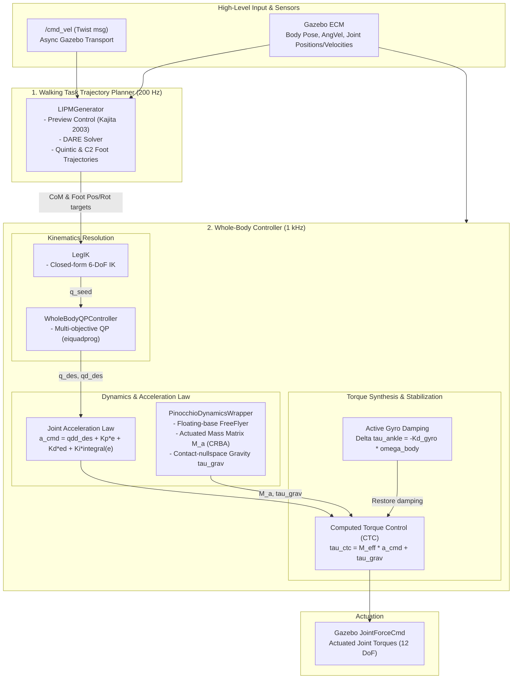

# HumanoidWalkingSystem Architecture

The `HumanoidWalkingSystem` package implements a real-time, model-based bipedal locomotion controller for the JVRC-1 humanoid robot inside Gazebo Sim (gz-sim). The physics engine runs at **1 kHz ($\Delta t_{\text{sim}} = 1\text{ ms}$)** with MuJoCo—a high update rate required to accurately resolve ground contact forces, friction cones, and foot-ground impacts—while the higher-level trajectory generator steps at **200 Hz ($\Delta t_{\text{traj}} = 5\text{ ms}$)**.

> [!NOTE]
> **Scope and Design Intent**: This controller represents a classical, foundational implementation of bipedal locomotion based on the Linear Inverted Pendulum Model (LIPM) and preview control. Consequently, its overall performance, disturbance rejection, and forward movement speed are modest and limited. The primary purpose of this package is to demonstrate and showcase how a complex, floating-base robotic system and contact-rich simulation can be constructed, integrated, and simulated within Gazebo, rather than to present a state-of-the-art walking control pipeline (such as advanced nonlinear Model Predictive Control or reinforcement learning).

---

## 1. High-Level Architecture

The control system is organized into two primary stages:
1. **Walking Task Trajectory Planner (200 Hz / 5 ms)**: Accepts velocity commands and plans dynamically stable Center of Mass (CoM) and footstep trajectories.
2. **Whole-Body Controller (1 kHz / 1 ms)**: Ingests planned trajectories and resolves them into actuator commands through an internal pipeline of **IK Seeding $\rightarrow$ QP Kinematics $\rightarrow$ Acceleration Law ($a_{\text{cmd}}$) $\rightarrow$ Computed Torque Control (CTC) $\rightarrow$ Active Gyro Stabilization**.



---

## 2. Theoretical Principles & Control Hierarchy

Bipedal walking is a challenging robotics problem. Unlike wheeled vehicles or quadrupeds, a humanoid robot is an **underactuated, dynamically unstable system**:
1. **Unactuated Floating Base**: The robot’s body is not fixed to the environment; it floats freely in six degrees of freedom with no external actuator directly controlling its position or orientation.
2. **Unilateral Contact Constraints**: The feet can only push against the ground—they cannot pull. If the center of pressure moves outside the boundary of the foot sole, the foot tips, and the robot falls.
3. **Inherent Instability**: The robot acts as an inverted pendulum with an unstable dynamic mode. Any perturbation causes the center of mass to accelerate away from equilibrium exponentially fast.

To solve this, the `HumanoidWalkingSystem` divides the problem into two complementary conceptual modules:
* **Walking Task Trajectory Planner (200 Hz / 5 ms)**: Simplifies the complex multi-body robot into an inverted pendulum, planning dynamically stable Center of Mass (CoM) and foot trajectories via preview control.
* **Whole-Body Controller (1 kHz / 1 ms)**: Computes and sets real-time joint control torques to execute the planned trajectories while stabilizing the floating base. Internally, the whole-body controller follows a deterministic stage-by-stage pipeline:
  $$\text{LegIK (Analytical Seeding)} \longrightarrow \text{QP (Kinematic Resolution)} \longrightarrow a_{\text{cmd}} \text{ (Acceleration Law)} \longrightarrow \text{CTC (Computed Torque)} \longrightarrow \text{Active Pitch/Roll Gyro Damping}$$

---

### 2.1 Walking Task Trajectory Planner: The Linear Inverted Pendulum (LIPM) & Preview Control

To generate a stable walking motion in real time, we cannot afford to plan full 3D multi-body dynamics at every millisecond. Instead, we project the robot's entire mass onto a single equivalent point mass at height $z_c$, known as the **Linear Inverted Pendulum Model (LIPM)**.

```
       O  Center of Mass (CoM: x, y, z_c)
      /
     /  Massless telescopic leg
    /
===o=== Ground Foot Contact (ZMP: p_x, p_y)
```

#### Why Keep Height Constant ($z = z_c$)?
By enforcing a strictly constant Center of Mass height ($\ddot{z} = 0$), vertical acceleration dynamics vanish. The horizontal equations of motion become completely **linear and decoupled**:
$$\ddot{x} = \frac{g}{z_c} (x - p_x), \qquad \ddot{y} = \frac{g}{z_c} (y - p_y)$$
where $(x, y)$ is the CoM position, $(p_x, p_y)$ is the **Zero-Moment Point (ZMP)** (the point on the ground where the net horizontal tipping moment is zero), and $g$ is gravitational acceleration.

#### The Fundamental Instability
The LIPM differential equation possesses an unstable pole:
$$\omega_0 = \sqrt{\frac{g}{z_c}} \approx \sqrt{\frac{9.81}{0.795}} \approx 3.51 \text{ rad/s}$$
This corresponds to an unstable time constant:
$$\tau = \frac{1}{\omega_0} \approx 0.28 \text{ s}$$
Because perturbations double roughly every $0.28\text{ seconds}$, a purely reactive controller is doomed: by the time the robot senses tipping, it is already too late to recover within the tiny boundary of a single footstep.

#### Anticipation via Preview Control
The solution is **Preview Control** ([Kajita et al., 2003](#references)):
* Instead of reacting only to current state error, the controller is given a **lookahead horizon** of future ZMP footstep references over $N = 160$ discrete steps ($160 \times 5\text{ ms} = 0.8\text{ s} \approx 2.81\tau$).
* By solving the **Discrete Algebraic Riccati Equation (DARE)** offline, we compute optimal state feedback gains ($G_x$), error integral gains ($G_i$), and preview feedforward gains ($G_p$).
* The preview gains allow the robot to **lean forward and sideways before the swing foot even lifts off**, ensuring that when the foot breaks contact, the ground reaction force is already aligned to catch the falling body.

Walking requires alternating between **Single Support** (one foot swinging while the other supports the body) and **Double Support** (both feet planted):
* **Ground Clearance**: The swing foot follows a $C^2$-smooth polynomial curve:
  $$z_{\text{swing}}(s) = 16 \, h_{\text{clear}} \, s^2 (1 - s)^2, \quad s \in [0, 1]$$
  This guarantees zero vertical velocity and zero vertical acceleration at lift-off ($s=0$) and touchdown ($s=1$), eliminating impulsive ground strike chatter.
* **Forward Progression**: Forward motion uses a quintic polynomial $s_{\text{poly}}(s) = s^3 (6s^2 - 15s + 10)$ ensuring smooth start and stop accelerations.
* **Finite Step Stopping**: The planner can optionally be configured with a finite step target (`num_steps`). On the final step, the swing foot trajectory is planned to land exactly level with the stance foot (`swingEndXb = (num_steps - 1) * stepLen`), bringing the feet side-by-side into a symmetrical, stable double-support standing pose.

---

### 2.2 Whole-Body Controller: From Cartesian Goals to Stabilized Motor Torques

The trajectory planner supplies Cartesian references (CoM target, foot positions/orientations, body attitude). On every **1 kHz ($\Delta t = 1\text{ ms}$)** simulation tick, the **Whole-Body Controller** executes the following deterministic pipeline inside `HumanoidWalkingSystem::PreUpdate`:

#### Stage A: State Ingestion (Gazebo ECM)
The controller queries Gazebo's Entity Component Manager (ECM) for the latest joint positions ($q$) and velocities ($\dot{q}$), as well as the world pose and angular velocity ($\omega$) of the robot body (pelvis link `PELVIS_S`).

#### Stage B: Analytical IK Seeding & Hierarchical QP Optimization (`LegIK` $\rightarrow$ `WholeBodyQPController`)
In an anthropomorphic robot, tasks frequently compete:
* Reaching the commanded forward step might stretch the leg close to its mechanical joint limits.
* Stance foot pitch and roll must stay strictly flat on the ground while the robot body translates laterally to balance over the supporting foot.
* Unweighted analytical inverse kinematics can encounter kinematic singularities or violate hard joint angle and velocity boundaries.

To resolve these trade-offs gracefully, [`WholeBodyQPController`](WholeBodyQPController.hh) formulates a **Quadratic Program** at each control tick:
$$\min_{\Delta q} \quad \frac{1}{2} \sum_{k} w_k \| J_k(q) \Delta q - e_k^* \|^2 + \frac{1}{2} \Delta q^T W_{\text{reg}} \Delta q$$
$$\text{subject to} \quad q_{\min} \le q + \Delta q \le q_{\max}, \quad |\Delta q| \le \dot{q}_{\max} \Delta t$$
* **Task Priorities ($w_k$)**: Stance foot grounding and CoM height tracking are given the highest weight, followed by forward step placement and body attitude regularization.
* **Analytical Seeding (`LegIK`)**: Closed-form 6-DoF geometric leg kinematics ([`LegIK`](LegIK.hh)) solves for the exact thigh, knee, and ankle angles in microseconds. This provides an optimal warm-start seed for the QP active-set solver (`eiquadprog`), enabling deterministic convergence in under $1\text{ ms}$ to produce desired joint targets $q_{\text{des}}$ and $\dot{q}_{\text{des}}$.

#### Stage C: Joint Acceleration Law ($a_{\text{cmd}}$)
Using the reference kinematics from the QP solver, the controller synthesizes desired joint accelerations using a PID tracking law with leak-integrator anti-windup:
$$a_{\text{cmd}} = \ddot{q}_{\text{des}} + K_p (q_{\text{des}} - q) + K_d (\dot{q}_{\text{des}} - \dot{q}) + K_i \int (q_{\text{des}} - q) dt$$

#### Stage D: Rigid-Body Dynamics & Computed Torque Control (`PinocchioDynamicsWrapper` $\rightarrow$ CTC)
Even with desired accelerations, links possess mass, rotational inertia, and dynamic cross-coupling. Applying computed torque control ([Park and Kim, 1998](#references)):
* **Actuated Mass Matrix ($M_a$)**: Computed via the Composite Rigid Body Algorithm (CRBA) to cancel inertial cross-coupling:
  $$\tau_{\text{ctc}} = M_{\text{eff}}(q) a_{\text{cmd}} + \tau_{\text{grav}}(q)$$
* **Contact-Consistent Gravity ($\tau_{\text{grav}}$)**: On a floating-base humanoid, naive gravity compensation erroneously assumes an external sky-hook supporting the body. By projecting generalized gravity $g(q)$ through stance contact constraints (contact-nullspace filtering), ground reaction forces $F_z \approx m_{\text{total}} g$ are explicitly accounted for, preventing the stance leg from buckling while keeping the swing leg effortlessly compensated.

#### Stage E: Torso Pitch/Roll Gyro Damping (Artificial Vestibular System) & Actuation
Even with Computed Torque Control, when standing or balancing on one foot, the robot's upper body acts as an inverted cantilever:
* Joint position errors respond only after angular tilt has already developed.
* To damp out tipping before it destabilizes balance, an **artificial vestibular reflex** directly measures the instantaneous body angular velocity ($\omega_{\text{pitch}}, \omega_{\text{roll}}$) from physics state and injects restoring damping torques into the stance ankle:
  $$\tau_{\text{ankle, pitch}} \mathrel{+}= -K_{d,\text{gyro}} \, \omega_{\text{pitch}}$$
  $$\tau_{\text{ankle, roll}} \mathrel{+}= -K_{d,\text{gyro}} \, \omega_{\text{roll}}$$
* **Actuation**: The final combined joint torques $\tau$ are written directly to Gazebo's `JointForceCmd` components on the ECM, driving the simulated joints for the next physics integration step.

---

## 3. References

1. S. Kajita, F. Kanehiro, K. Kaneko, K. Fujiwara, K. Harada, K. Yokoi, and H. Hirukawa, *"Biped walking pattern generation by using preview control of zero-moment point,"* 2003 IEEE International Conference on Robotics and Automation (ICRA), Taipei, Taiwan, 2003, pp. 1620-1626 vol.2, doi: [10.1109/ROBOT.2003.1241826](https://doi.org/10.1109/ROBOT.2003.1241826).
2. J. H. Park and K. D. Kim, *"Biped robot walking using gravity-compensated inverted pendulum mode and computed torque control,"* 1998 IEEE International Conference on Robotics and Automation (ICRA), Leuven, Belgium, 1998, pp. 3528-3533 vol.4, doi: [10.1109/ROBOT.1998.680985](https://doi.org/10.1109/ROBOT.1998.680985).
3. JVRC-1 Humanoid Model: [isri-aist/jvrc_mj_description](https://github.com/isri-aist/jvrc_mj_description), National Institute of Advanced Industrial Science and Technology (AIST), Japan.
